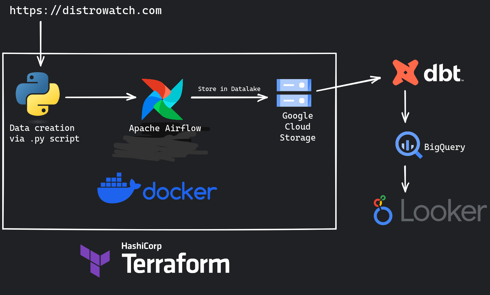
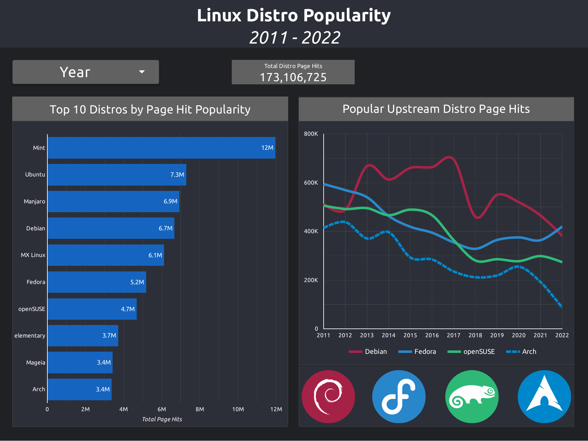

# Linux Distro Popularity

A data pipeline with Python Scraping, Docker, Airflow, dbt, Terraform, Looker, and GCP

## Description

### Objective

The project will intake Linux Distribution page-hit data from Distrowatch and create a data pipeline that consumes the page-hit data per year, to generate some data and analytics regarding popular Linux Distros. The data coming in is generated by webscraping the yearly data on Distrowatch. The data is processed in batch format and stored to the data lake. The batch job will then consume this data, apply transformations, and create the desired tables for our dashboard to generate analytics. We will try to analyze metrics like top 10 distro of all time, .

### Dataset

[**Distrowatch**](https://distrowatch.com/) is a website that tracks Linux Distros. There is a table that records and ranks Distros based on their hits per day. Using a Python Script, we scrape this back to 2011 and generate the yearly rankings in a .csv file.

### Tools & Technologies

- Cloud - [**Google Cloud Platform**](https://cloud.google.com)
- Infrastructure as Code software - [**Terraform**](https://www.terraform.io)
- Containerization - [**Docker**](https://www.docker.com), [**Docker Compose**](https://docs.docker.com/compose/)
- Orchestration - [**Airflow**](https://airflow.apache.org)
- Transformation - [**dbt**](https://www.getdbt.com)
- Data Lake - [**Google Cloud Storage**](https://cloud.google.com/storage)
- Data Warehouse - [**BigQuery**](https://cloud.google.com/bigquery)
- Data Visualization - [**Data Studio**](https://datastudio.google.com/overview)
- Language - [**Python**](https://www.python.org)

### Architecture ******PLACEHOLDER******

### Final Result ******PLACEHOLDER******

